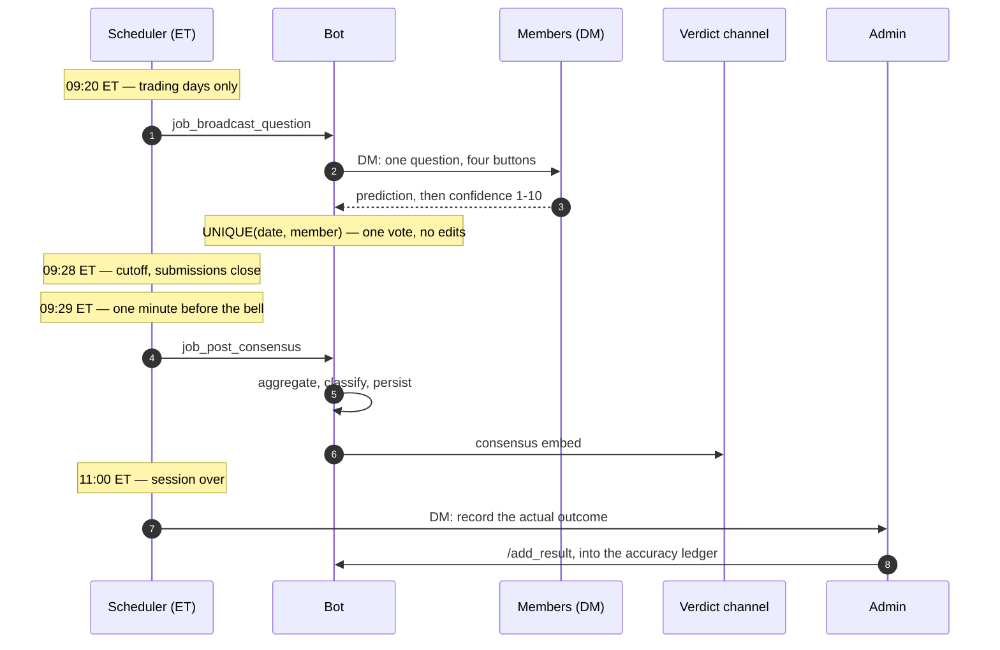

<h1 align="center">🏛️ Council of Wise Men</h1>

<p align="center">
  <em>A Discord bot that turns twenty independent traders into one daily signal —<br>
  wisdom-of-crowds, applied to the Nasdaq&nbsp;100 futures open.</em>
</p>

<p align="center">
  <a href="https://github.com/SaiStyles/Wisdom/actions/workflows/ci.yml"></a>
  
  
  
</p>

---

## The idea

In 1906 Francis Galton watched 787 fairgoers guess the weight of an ox. No single guess was right. The **median of all of them** was off by one pound.

James Surowiecki's *The Wisdom of Crowds* names the four conditions that make this work: **diversity** of opinion, **independence** of judgement, **decentralisation** of knowledge, and a mechanism for **aggregation**. Break any one — especially independence — and the crowd stops being wise and starts being a herd.

Trading Discords break all four by design. Everyone reads the same chart, in the same channel, in real time, and the loudest voice anchors the room.

This bot rebuilds the four conditions mechanically:

| Condition | How the bot enforces it |
|---|---|
| **Diversity** | The roster is deliberately composed across eleven schools of market analysis — ICT, Wyckoff, Volume Profile, order flow, quant, macro, discretionary tape reading. Uncorrelated reasoning is the whole point. See [docs/methodology.md](docs/methodology.md). |
| **Independence** | The question arrives as a **private DM**. Nobody sees the running tally. There is no group chat before the cutoff. |
| **Decentralisation** | Every member trades their own book with their own framework; nothing is coordinated. |
| **Aggregation** | One scheduled job counts the votes, weighs the confidence, classifies the signal, and posts a single embed. |

No individual vote is ever shown. Votes are immutable once cast. Late submissions are impossible. Those aren't UX choices — they're the experiment's controls.

---

## The daily cycle



The eight-minute window (09:20–09:28 ET) is deliberate. Long enough to form a read; too short to go and ask somebody else what they think.

---

## What lands in the channel

> ### 🏛️ COUNCIL SIGNAL — 2026-04-24
>
> **🟢 HIGH CONVICTION — EXPANSION UP**
>
> | 📈 Expansion Up | 📉 Expansion Down | ↔️ Expansion Both |
> |---|---|---|
> | 13/18 (72.2%) | 2/18 (11.1%) | 2/18 (11.1%) |
>
> | ⬜ Range | 🎯 Avg Confidence | 👥 Submissions |
> |---|---|---|
> | 1/18 (5.6%) | 7.4/10 | 18/20 |

Green for high conviction, gold for moderate, red for *stay out*. **Red is a valid answer** — a crowd that hasn't converged is information, not failure.

### How the signal is classified

Evaluated top to bottom; first match wins ([`src/domain/classifier.py`](src/domain/classifier.py)):

| # | Condition | Signal |
|---|---|---|
| 1 | Turnout below 50% of the active roster | 🔴 NO_SIGNAL |
| 2 | Average confidence below 5/10 | 🔴 NO_SIGNAL |
| 3 | Leading option ≥ 60% **and** average confidence ≥ 7 | 🟢 HIGH |
| 4 | Leading option ≥ 50% | 🟡 MODERATE |
| 5 | Anything else | 🔴 NO_SIGNAL |

Quorum is a *proportion* of the live roster rather than a hard-coded number, so the gate stays honest as the council grows or shrinks. Accuracy statistics count only HIGH and MODERATE days — scoring the days the bot explicitly refused to call would flatter the numbers.

---

## Features

- **Scheduled DM broadcast** to every active member on weekdays, with an NYSE holiday calendar and an admin `/skip_today` override.
- **Two-step button submission** — direction, then confidence 1–10. Built on Discord persistent views, so a restart mid-window doesn't leave dead buttons in anyone's DMs.
- **Immutable votes**, enforced at the database level rather than only in the UI.
- **Idempotent jobs.** A delivery log prevents double-DMs; a `posted_to_group` flag prevents double-posts. Restart the process as often as you like.
- **Timezone-explicit scheduling.** Every cron trigger is pinned to `America/New_York`, so the bot behaves identically on a UTC container and on a laptop in another timezone.
- **Accuracy ledger** — the admin records the day's actual outcome; `/stats` scores the council against reality and `/export` dumps the history as CSV.
- **Attendance tracking** per member, counted only from their join date forward.
- **Errors surface.** A global handler catches slash-command and event-loop exceptions, replies to the user, and DMs the admin the traceback.
- **72 tests** across the domain logic, every repository, the scheduler jobs and the trading calendar.

---

## Architecture

```
main.py                     ensure_schema() -> build_bot() -> run
config.py                   environment + schedule constants

src/
├── bot/
│   ├── client.py           bot construction, view registration, slash-command sync
│   ├── views.py            PredictionView / ConfidenceView / ResultView
│   ├── formatting.py       question text, onboarding brief, consensus embed
│   └── handlers/           admin · membership · lifecycle · submission · errors
├── domain/                 <- pure functions: no I/O, no Discord
│   ├── aggregator.py       votes -> counts, percentages, average confidence
│   ├── classifier.py       aggregate -> HIGH / MODERATE / NO_SIGNAL
│   └── stats.py            accuracy and attendance
├── db/
│   ├── schema.sql          members · predictions · results · daily_aggregates · skips · broadcast_log
│   ├── connection.py       context manager, WAL, foreign keys on
│   ├── migrations.py       idempotent schema + additive column migrations
│   └── repositories/       one module per table, dataclasses out
├── scheduler/
│   ├── runner.py           AsyncIOScheduler pinned to ET
│   ├── jobs.py             broadcast · consensus · session-end reminder
│   └── calendar.py         NYSE holidays + is_trading_day()
├── services/
│   ├── broadcaster.py      DM fan-out with delivery log and Forbidden handling
│   └── session_state.py    is the submission window open right now?
└── utils/timezones.py      ET helpers
```

The layering is the point: **`src/domain/` knows nothing about Discord or SQLite.** It takes dataclasses and returns dataclasses, which is why the interesting logic is testable without mocking a single Discord API call. Handlers stay thin, and the scheduler jobs are the only place where I/O, persistence and domain logic meet.

Deeper notes on the data model, failure modes and design trade-offs: [docs/architecture.md](docs/architecture.md).

**Stack:** Python 3.12+ · [discord.py](https://github.com/Rapptz/discord.py) 2.x · APScheduler · SQLite (WAL) · pytz

---

## Quickstart

```bash
git clone https://github.com/SaiStyles/Wisdom.git
cd Wisdom
python -m venv .venv
source .venv/bin/activate        # Windows: .venv\Scripts\activate
pip install -r requirements.txt

cp .env.example .env             # then fill it in — see below
python scripts/seed_members.py
python main.py
```

Startup is healthy when the log reads:

```
DB schema ready.
Logged in as <YourBot> (id=...)
Synced 9 slash commands to guild ...
Scheduler started.
```

### Configuration

| Variable | Meaning |
|---|---|
| `BOT_TOKEN` | Discord bot token from the Developer Portal. Never commit it. |
| `ADMIN_DISCORD_ID` | Your Discord user ID — the only account admin commands answer to. |
| `GUILD_ID` | The server slash commands are synced to. |
| `GROUP_CHANNEL_ID` | Channel the consensus embed is posted to. |
| `DB_PATH` | SQLite file path. Defaults to `data/council.db`. |
| `TEST_MODE` | `true` unlocks three `/test_*` commands and bypasses the trading-day and time-window gates, so the full cycle can be exercised on a Sunday afternoon. **`false` in production.** |

### Discord Developer Portal

Enable the **Server Members Intent**. Message Content Intent is not needed — this bot never reads message content. Invite with scopes `bot` + `applications.commands` and permissions *Send Messages*, *Embed Links*, *Read Message History*.

---

## Commands

| Command | Who | What |
|---|---|---|
| `/status` | roster | Have I submitted today? |
| `/welcome` | roster | The full onboarding brief plus today's status. |
| `/add_member` | admin | Add a member via the user picker; auto-DMs the welcome text. |
| `/remove_member` | admin | Deactivate a member — a soft delete, so history survives. |
| `/add_result` | admin | Record today's actual outcome. |
| `/stats` | admin | Council accuracy across all signal days. |
| `/member_stats` | admin | Per-member attendance. |
| `/skip_today` | admin | Cancel the cycle for today (FOMC, half-day, a holiday the calendar missed). |
| `/export` | admin | Full result history as CSV. |
| `/test_broadcast` · `/test_consensus` · `/test_reset` | admin, `TEST_MODE` only | Fire a job on demand; clear today's rows. |

Admin replies are always ephemeral.

---

## Tests

```bash
pip install -r requirements-dev.txt
python -m pytest tests/ -q
```

72 tests, about three seconds, no network and no Discord connection. Each runs against a fresh temporary SQLite file, so the suite is order-independent and leaves nothing behind. Scheduler jobs are exercised against a stub bot to verify delivery, deduplication and the trading-day gate.

The manual QA script for the parts only a human with a mouse can check — button flows, DM permissions, embed rendering — is in [docs/testing.md](docs/testing.md).

---

## Deployment

The bot has to be running at 09:20 ET on a weekday or the day is simply lost. It ships with a `Procfile` and `runtime.txt` for Procfile-aware hosts, a `run.bat` auto-restart launcher for self-hosting on Windows, and a systemd unit in [`deploy/`](deploy/) for a Linux box. Options and trade-offs: [docs/deployment.md](docs/deployment.md).

---

## Limitations and honest caveats

- **The signal is unvalidated.** The accuracy ledger exists precisely because the premise hasn't been proven. A council that hasn't accumulated a few hundred trading days hasn't said anything statistically meaningful.
- **Crowd wisdom needs a crowd.** Below roughly ten diverse members the turnout gate mostly returns NO_SIGNAL — correct behaviour, and a boring one.
- **SQLite suits one process on one machine.** It's the right call at this scale and the wrong one the moment there are two writers; the repository layer is deliberately thin so that dialect swap stays contained.
- **The holiday calendar is hard-coded** through 2026 and needs a yearly top-up in `src/scheduler/calendar.py`.
- **This is not financial advice**, and neither is anything the bot posts.

---

## License

MIT — see [LICENSE](LICENSE).
